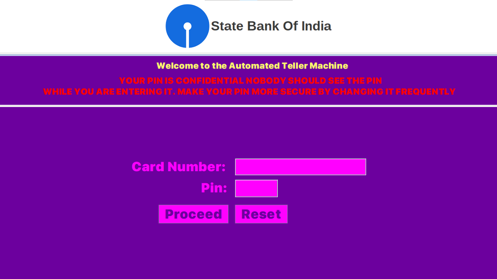
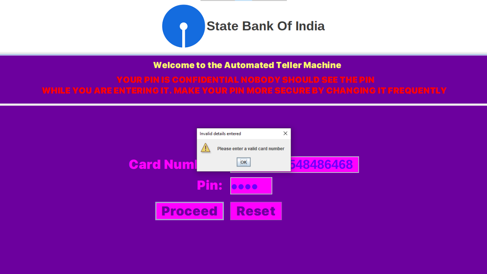
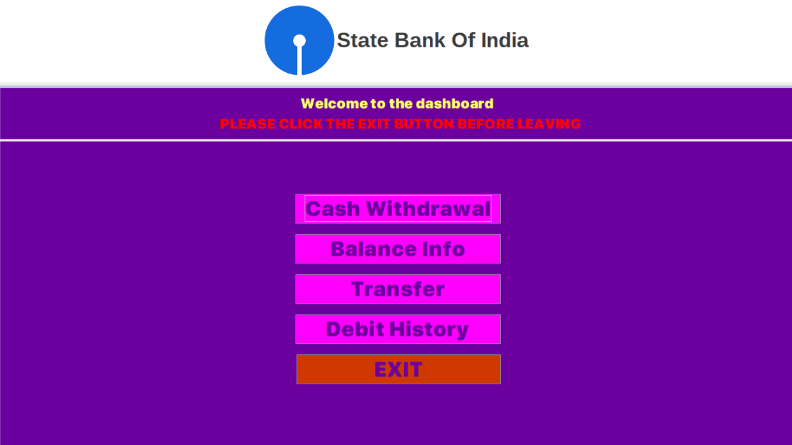
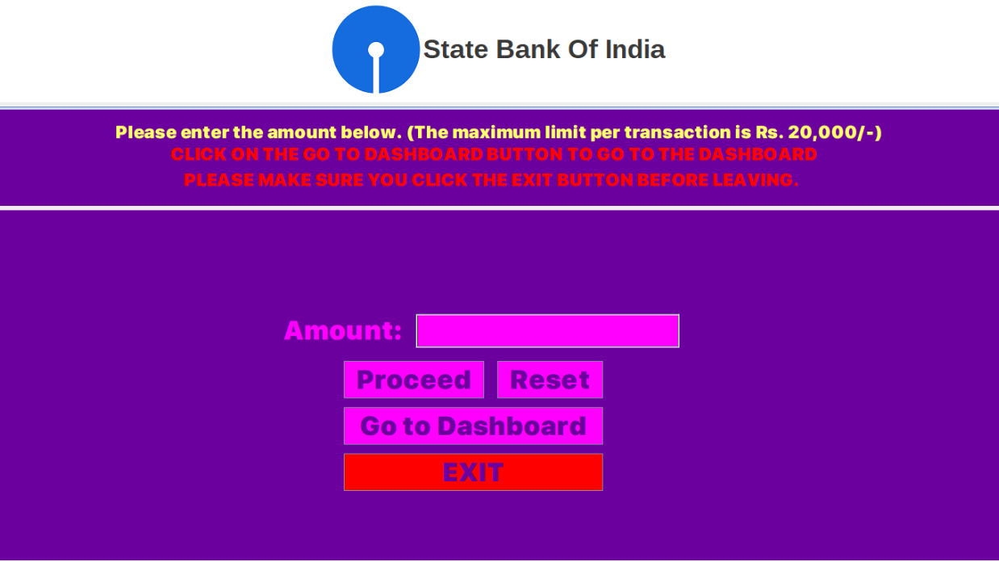
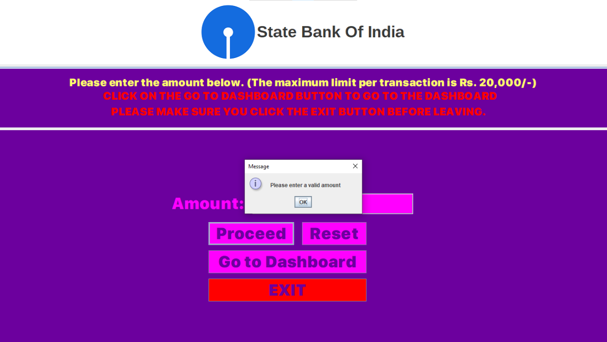
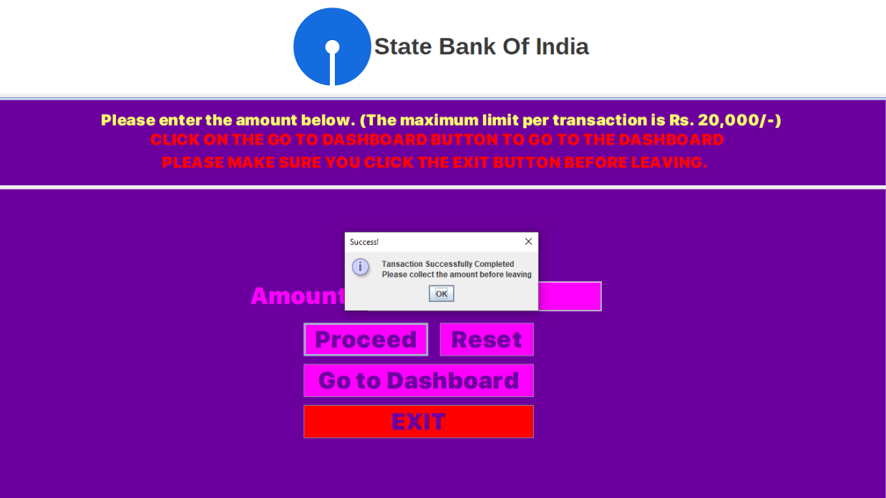
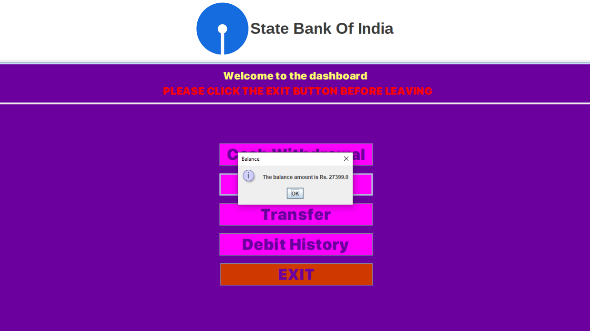
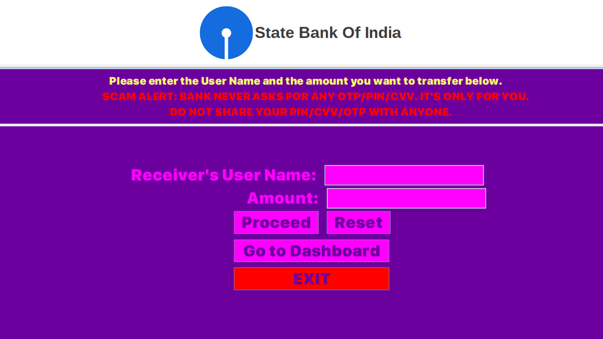
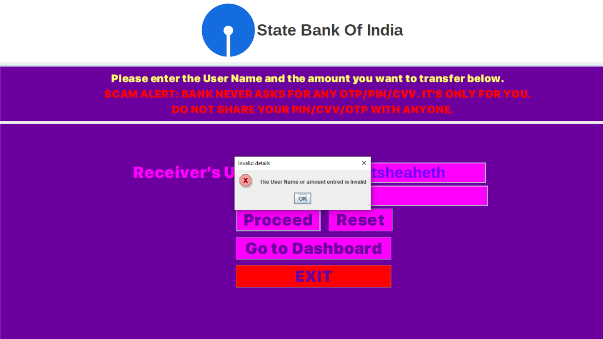
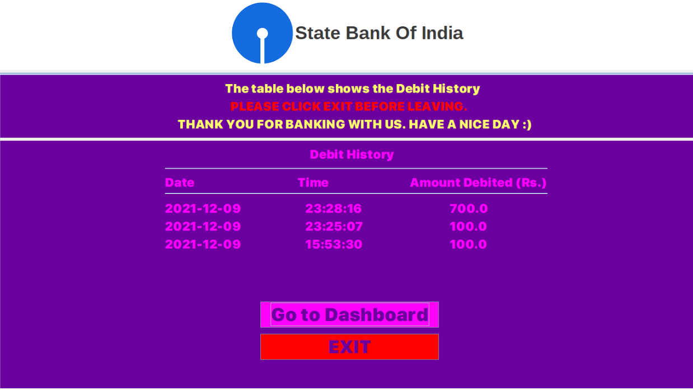

## Screenshots

<h3>Login</h3>

<h3>Invalid Card</h3>

<h3>Valid Card</h3>

<h3>Cash Withdrawal</h3>

<h3>Valid amount</h3>

<h3>Successful Transaction</h3>

<h3>Balance Information</h3>

<h3>Transfer</h3>

<h3>Invalid UserName or Amount</h3>

<h3>Successful Transaction</h3>

<h3>Debit History</h3>
